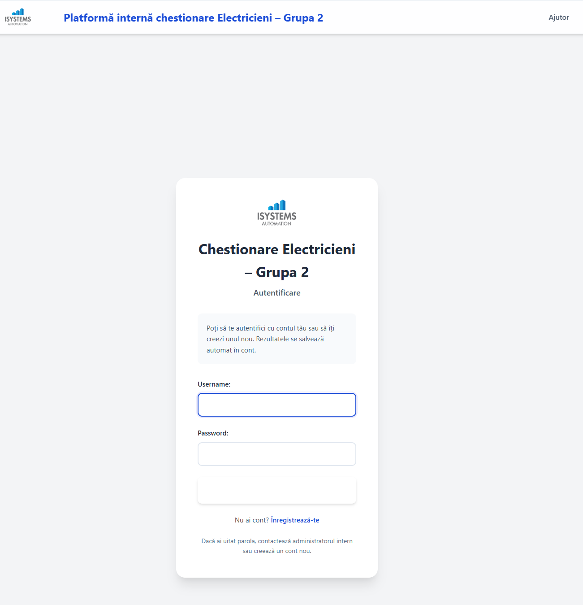

# Platformă internă chestionare Electricieni – Grupa 2

**🌐 Live Platform:** [https://quiz.isystemsautomation.com/](https://quiz.isystemsautomation.com/)

Online quiz platform for electrician certification (Grupa 2). Includes Electrotehnică, Legislație Gr.2 and Norme Tehnice Gr.2 with automatic grading and explanations. Questions are stored in the database so they can be corrected and completed over time.

## Features

- **Mandatory Authentication**: All pages require login except registration
- **Block-based Quizzes**: Questions organized in blocks of ~20
- **Progress Tracking**: Dashboard shows last attempt per block with color coding
- **Automatic Grading**: Server-side grading with explanations
- **Editable Questions**:
  - Normal users can fill in missing `correct` / `explanation`
  - Superusers can edit everything (including images)
- **Personal Notes per Block**: Each user can save private notes per subject/block

## Setup Instructions

### Prerequisites

- Python 3.10 or higher
- pip (Python package manager)

### Installation (local or server)

1. **Create a virtual environment:**
   ```bash
   python -m venv .venv
   ```

2. **Activate the virtual environment:**
   
   On Windows (PowerShell):
   ```powershell
   .venv\Scripts\Activate.ps1
   ```
   
   On Windows (Command Prompt):
   ```cmd
   .venv\Scripts\activate.bat
   ```
   
   On Linux/Mac:
   ```bash
   source .venv/bin/activate
   ```
   
   **Important:** After activation, you should see `(.venv)` at the beginning of your command prompt. If you don't see this, the virtual environment is not activated and you'll get an "externally-managed-environment" error.

3. **Install dependencies:**
   ```bash
   pip install -r requirements.txt
   ```

4. **Run migrations:**
   ```bash
   python manage.py migrate
   ```

5. **Create a superuser (optional, for admin access):**
   ```bash
   python manage.py createsuperuser
   ```

6. **Start the development server:**
   ```bash
   python manage.py runserver
   ```

7. **Import questions from JSON into the database:**
   ```bash
   python manage.py import_questions
   ```

8. **Access the application (development):**
   ```bash
   python manage.py runserver
   ```
   - Open your browser and go to: `http://127.0.0.1:8000/`
   - You will be redirected to the login page
   - Register a new account or use an existing one

## Project Structure

```
gr2-quiz-platform/
├── gr2quiz/              # Django project settings
│   ├── settings.py
│   ├── urls.py
│   └── ...
├── quiz/                 # Main quiz application
│   ├── models.py         # BlockAttempt model
│   ├── views.py         # Quiz views
│   ├── loader.py        # JSON data loader utility
│   ├── templates/       # HTML templates
│   └── ...
├── quiz_data/            # JSON quiz data files
│   ├── electrotehnica.json
│   ├── legislatie-gr-2.json
│   └── norme-tehnice-gr-2.json
├── static/              # Static files (CSS)
│   └── css/
│       └── app.css
├── manage.py
├── requirements.txt
└── README.md
```

## Screenshots

### 1. Login Page


The login page allows you to authenticate with your account or navigate to registration. If you forgot your password, contact the internal administrator or create a new account.

### 2. Dashboard


The dashboard displays all available disciplines and their blocks. Each block tile shows your progress with color-coded status indicators.

### 3. Quiz Taking Page


When taking a quiz, you can see all questions, select answers, and edit questions that are missing answers or explanations.

### 4-6. Additional Views
  

## User Guide – "Electrician Quizzes – Group 2" Platform

### 1. Creating an Account (Registration)

To use the platform, you must create an account.

**Steps:**

1. Access the platform's main page at **[https://quiz.isystemsautomation.com/](https://quiz.isystemsautomation.com/)**
2. Click on **"Înregistrează-te"** (Register)
3. Fill in:
   - **Username**
   - **Password**
4. Confirm registration
5. After registration, log in using the credentials you created

### 2. Authentication

1. Enter your **Username** and **Password**
2. Click **"Autentificare"** (Login)
3. You will be redirected to the Dashboard

**Note:** If you forgot your password, contact the internal administrator or create a new account.

### 3. Dashboard – Navigation

The Dashboard contains three sections:

- **Electrotehnică** (Electrotechnics)
- **Legislație GR. 2** (Legislation GR. 2)
- **Norme Tehnice GR. 2** (Technical Standards GR. 2)

Each section contains blocks:

- **Bloc 1** (Block 1)
- **Bloc 2** (Block 2)
- **Bloc 3** (Block 3)
- etc.

Each block contains questions (typically ~20 questions per block).

**Block Color Coding:**
- **White**: No attempts yet
- **Green**: Perfect score (all questions correct)
- **Yellow**: Good score (18-19 correct out of 20)
- **Red**: Needs improvement (less than 18 correct)

### 4. Taking Quizzes

1. **Select a block** from the dashboard
2. **Answer the questions** by selecting option **a**, **b**, or **c** for each question
3. **Submit your answers** by clicking **"Trimite răspunsurile"** (Submit answers)
4. At the end, the system displays:
   - Your **score** (e.g., 18/20)
   - **Correct answers**
   - **Explanations** (if available)
5. Results are **saved automatically**

### 5. Completing Questions Without Answer or Explanation

The platform marks incomplete questions with:

- **"Lipsă răspuns"** (Missing answer) – red badge
- **"Lipsă explicație"** (Missing explanation) – red badge

**Important Rules:**

**Normal users can:**
- Complete the correct answer if it's missing
- Complete the explanation if it's missing

**Normal users CANNOT modify:**
- Existing answers
- Existing explanations

### 6. Administrator Rights

Only the Administrator can:
- Modify existing answers
- Modify existing explanations
- Correct questions
- Update the database
- Edit image settings

The Administrator has **full editing access** to all questions.

### 7. How a User Completes an Incomplete Question

If you see:
- **"Lipsă răspuns"** (Missing answer)
- or **"Lipsă explicație"** (Missing explanation)

**Steps:**

1. Click **"Edit / Completează"** (Edit / Complete)
2. **Select the correct answer** (if missing) – choose **a**, **b**, or **c**
3. **Enter the explanation** (if missing) – write the explanation text
4. Click **"Salvează"** (Save)
5. You will be redirected back to the quiz page with your previous answer selections preserved

**Note:** Once both answer and explanation exist, only administrators can edit them.

### 8. How an Administrator Modifies an Existing Question

The Administrator:

1. Clicks **"Edit / Completează"** (Edit / Complete)
2. Can modify:
   - The correct answer
   - The explanation
   - Image settings (optional)
3. Saves the changes by clicking **"Salvează"** (Save)

### 9. Interpreting Results

The platform displays:

- **Total score** (e.g., 18/20)
- **Percentage** (e.g., 90%)
- **Correct questions** – marked with green **"Corect"** badge
- **Incorrect questions** – marked with red **"Greșit"** badge
- **Ungradable questions** – marked with gray **"Ne-evaluabil"** badge (questions without a correct answer)
- **Explanations** – shown for each question (if available)

### 10. Saving Data

- Answers are **saved automatically** as you select them
- No manual save is required
- Your answer selections are preserved even if you navigate away to edit a question
- Results are saved automatically after submission

### 11. General Rules

**User (Normal Account):**
- Can complete only **missing data**
- Cannot modify **existing data**
- Can add personal notes per block (private, visible only to you)

**Administrator (Superuser):**
- Can modify **any question**
- Can correct **answers**
- Can correct **explanations**
- Can update the **database**
- Has full access to the admin panel at `/admin/`

---

## Usage – admin / superuser

As a superuser you have full control over the content and configuration of the quiz.

### Admin panel

1. Log in with your superuser credentials.
2. Open `/admin/` in your browser.
3. You can manage:
   - `Question` – all questions, answers, explanations and image settings
   - `BlockAttempt` – attempts per user/block (read‑only for auditing)
   - `BlockNote` – personal notes per user/block (optional)

For each **Question** you can edit:

- `subject`, `qid`, `block_number`
- `text`, `option_a`, `option_b`, `option_c`
- `correct` (a/b/c)
- `explanation`
- `image_base` – base filename for images (e.g. `qe23`)

### Importing / exporting questions

- Import (seed or update empty fields from JSON):
  ```bash
  python manage.py import_questions
  ```
- Export current database questions back into `quiz_data/*.json`:
  ```bash
  python manage.py export_questions
  ```

The database is the main source of truth; JSON is mainly for backup / sync / external editing.

## Database

The application uses SQLite by default. The database file (`db.sqlite3`) will be created automatically when you run migrations.

## Security

- All routes except `/accounts/login/`, `/accounts/register/`, and static files require authentication
- CSRF protection is enabled on all forms
- Passwords are hashed using Django's default password hashing

## Notes

- Questions with `correct: null` are excluded from grading (ungradable questions)
- Blocks are assigned from the JSON import based on `block` number or sequential by 20 if missing
- The dashboard shows the **last attempt** per block, not the best attempt
- JSON files are seed data; the **database is the source of truth** for questions and edits

© 2024 ISYSTEMS AUTOMATION S.R.L.
